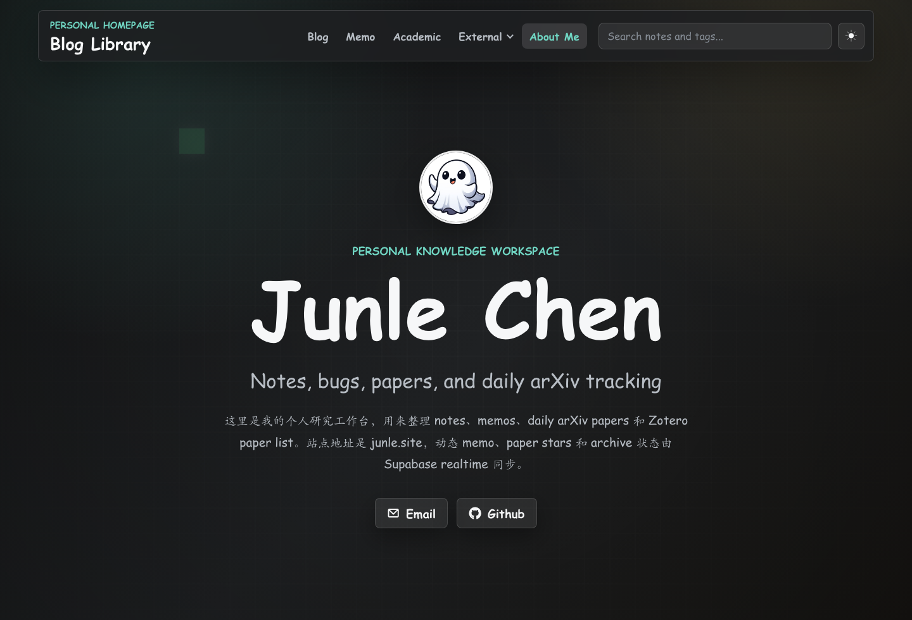
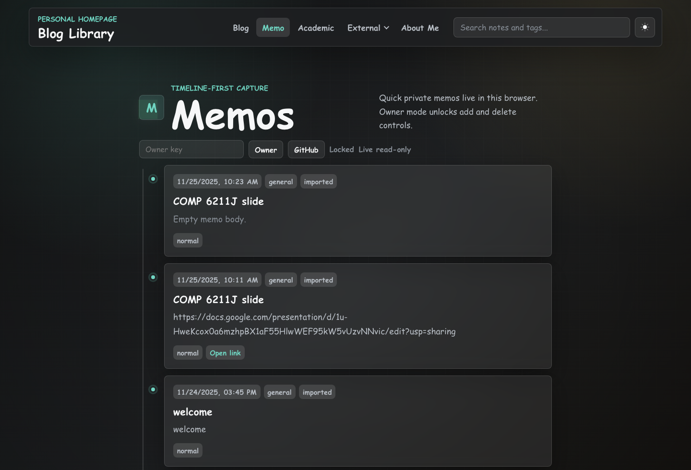
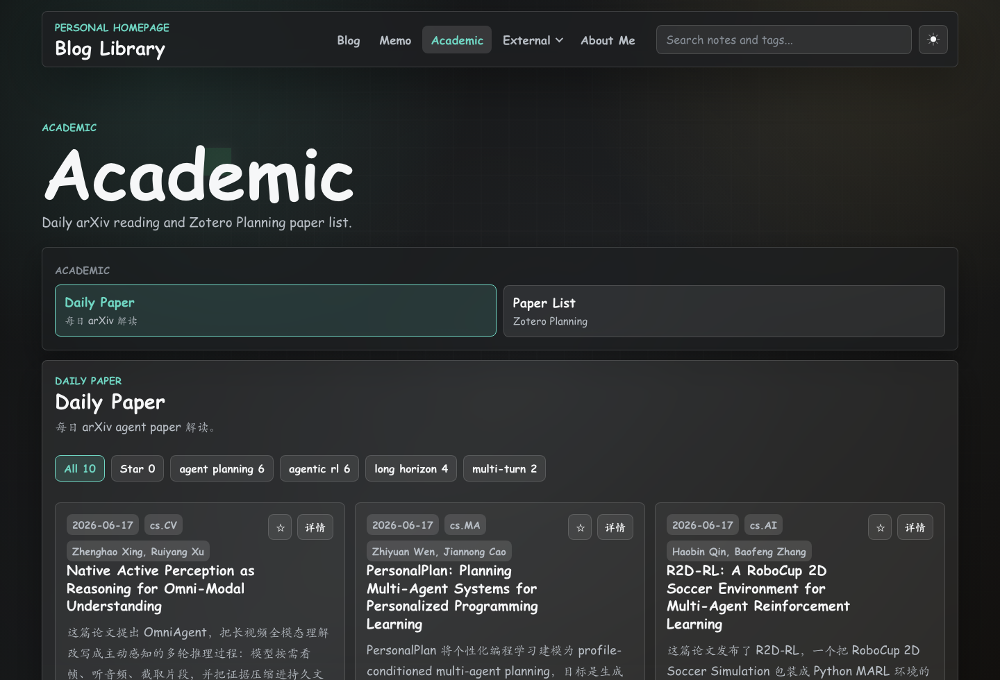
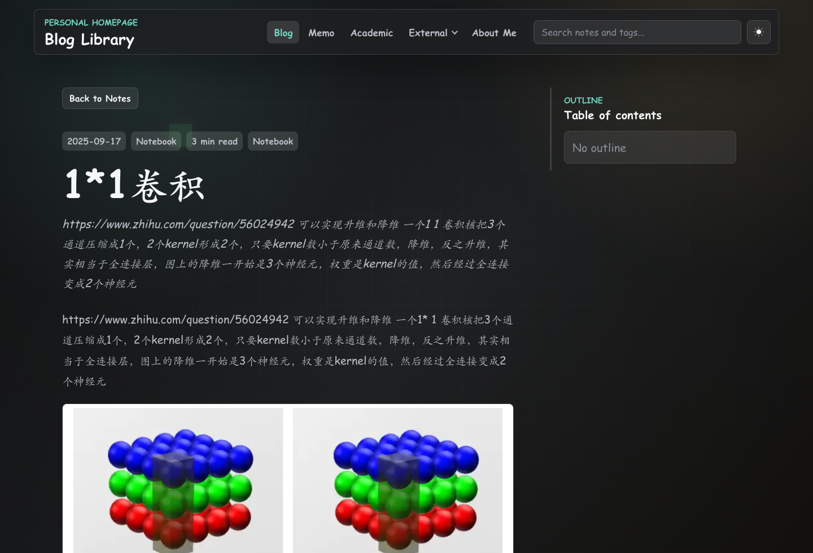

# Junle Chen HomePage

Junle Chen 的个人研究主页和轻量知识工作台，用来整理 notes、memos、daily papers、Zotero paper list 和研究链接。

- Website: [https://junle.site](https://junle.site)
- Repository: [junle-chen/ac-homepage](https://github.com/junle-chen/ac-homepage)
- Maintainer: Junle Chen

## Screenshots

### About / Workspace



About 页面是站点入口，说明这个网页是个人 research workspace：用于长期记录 notes、bugs、papers、daily arXiv tracking，以及 agent planning / agentic RL / long-horizon planning 相关研究工作流。

### Memos



Memos 是时间线式的快速记录区。访客可以读取公开 memo；owner 通过 GitHub 登录后可以新增、删除 memo，并通过 Supabase realtime 在多个浏览器之间同步。

### Academic



Academic 面板包含两个主要视图：

- `Daily Paper`: 每日 arXiv agent paper 阅读、筛选、星标和详细解读。
- `Paper List`: 从 Zotero/Planning 文献库导出的 paper list，用于长期整理候选论文。

### Notes Reader



Notes 在站内 reader 中打开，不跳转到裸 Markdown 文件。Reader 支持正文渲染、图片、MathJax、右侧 outline 和 Giscus comments。

## Features

- `About`: 个人介绍、研究方向和站点入口。
- `Notes`: Markdown notes/pages 的站内阅读器，支持搜索、分类、归档状态、目录和 MathJax。
- `Memos`: 面向快速记录的 timeline，支持 GitHub owner 登录后的实时写入。
- `Academic`: Daily Paper、Paper List、论文星标、论文摘要、详情 modal 和导出文本。
- `Realtime`: Supabase 保存共享 memos、paper stars、Zotero stars 和 note archive 状态。
- `Comments`: Giscus 基于 GitHub Discussions 为文章提供评论。
- `Deployment`: GitHub Pages + custom domain `junle.site`。

## Realtime Architecture

这个站点本身是静态站点，动态状态由 Supabase + GitHub OAuth 提供。核心目标是：不引入后端服务器，也能让 memo、paper star、archive 状态在多设备和多浏览器之间共享。

### Frontend Entry Points

- `src/components/scripts.pug`
  - 加载 `@supabase/supabase-js@2`
  - 加载 `js/realtime-config.js`
  - 加载主脚本 `js/main.js`

- `src/js/realtime-config.js`
  - `supabaseUrl`: Supabase project URL
  - `supabaseAnonKey`: 前端可公开的 publishable anon key
  - `ownerGithubIds`: 允许写入的 GitHub numeric id
  - `ownerGithubLogins`: 允许写入的 GitHub login
  - `redirectTo`: GitHub OAuth 返回当前页面

- `src/js/main.js`
  - `createJunleRealtimeStore()` 封装 realtime store
  - `window.JunleRealtime` 暴露登录、登出、读写 memo、读写 reaction 的接口
  - UI 组件通过 `on("memos")`、`on("reactions:daily_paper")` 等事件更新页面

### Supabase Tables

SQL schema 在 `supabase/homepage-realtime.sql`。

`site_memos` 保存 live memo：

- `id`: memo uuid
- `title`, `content`, `category`, `priority`, `source`
- `created_by`: Supabase auth user id
- `created_at`, `updated_at`
- `deleted_at`: 预留软删除字段

`site_reactions` 保存共享状态：

- `item_type`: `daily_paper` / `zotero_paper` / `note_archive`
- `item_key`: 站内 item 的稳定 key
- `active`: 当前状态是否开启
- `unique (item_type, item_key)`: 同一 item 只有一条状态记录

### Auth And RLS

Supabase 使用 GitHub OAuth 登录。SQL 中的 `public.is_homepage_owner()` 会检查 JWT 里的 GitHub identity：

- GitHub numeric id: `108796659`
- GitHub login: `junle-chen`
- The SQL accepts common Supabase GitHub metadata keys: `provider_id`, `sub`, `user_id`, `user_name`, `preferred_username`, `nickname`, and `name`.

Row Level Security 策略是：

- 访客可以读取公开 memo 和 reaction。
- 只有 owner 可以 insert/update/delete memo。
- 只有 owner 可以 insert/update/delete reaction。

这意味着 anon key 可以放在前端仓库里；真正的写入权限由 Supabase Auth + RLS 控制。GitHub OAuth client secret 不能放进仓库，只能配置在 Supabase/GitHub 后台。

### Realtime Subscriptions

前端使用 Supabase `postgres_changes` 订阅：

- `homepage-site-memos`: 监听 `site_memos` 的 insert/update/delete，然后重新加载 memo timeline。
- `homepage-site-reactions-daily_paper`: 监听 Daily Paper 星标/删除状态。
- `homepage-site-reactions-zotero_paper`: 监听 Zotero Paper 星标状态。
- `homepage-site-reactions-note_archive`: 监听 note archive 状态。

当某个浏览器写入一条 memo 或 star 状态后，其他已打开的浏览器会收到 Supabase realtime 事件，并重新读取当前状态。

### Local Fallback

如果 Supabase 未配置、网络不可用或用户未登录：

- 站点仍能作为静态站点正常阅读。
- Memos 和 stars 会降级到只读或本地 `localStorage` 状态。
- UI 状态会显示 `Local mode`、`Live read-only`、`Signed in read-only` 或 `Live owner`。

## Configure Realtime

1. 在 Supabase 创建 project，复制 Project URL 和 publishable anon key。
2. 在 Supabase SQL Editor 运行：

```sql
-- supabase/homepage-realtime.sql
```

3. 在 GitHub Developer Settings 创建 OAuth App，callback URL 使用：

```text
https://<project-ref>.supabase.co/auth/v1/callback
```

4. 在 Supabase Authentication Providers 中启用 GitHub，填入 GitHub Client ID 和 Client Secret。
5. 更新 `src/js/realtime-config.js`：

```js
window.JUNLE_REALTIME_CONFIG = {
	supabaseUrl: "https://<project-ref>.supabase.co",
	supabaseAnonKey: "<publishable-anon-key>",
	ownerGithubIds: ["108796659"],
	ownerGithubLogins: ["junle-chen"],
	redirectTo: window.location.origin + window.location.pathname,
};
```

## Configure Giscus

Giscus 用 GitHub Discussions 做评论系统，配置在 `src/js/main.js` 的 `GISCUS_CONFIG`。

当前配置指向：

- repo: `junle-chen/ac-homepage`
- category: `General`
- mapping: `specific`

每篇 note 会用自己的 `data-comment-term` 生成独立评论线程。

## Local Development

```bash
npm install
npm run build
npm run dev
```

如果使用 pnpm，遇到 `Ignored build scripts` 提示时按 pnpm 提示审批依赖构建脚本：

```bash
pnpm install
pnpm approve-builds
pnpm run build
pnpm run dev
```

`npm run build` 生成 `dist/`。`npm run dev` 启动 gulp watch，并从 `dist` 预览。

## Project Structure

- `config.json`: 首页标题、描述、入口按钮、个人链接、头像和 WebGL 背景开关。
- `src/components/`: Pug 模板。
- `src/css/`: LESS styles。
- `src/js/main.js`: 页面交互、reader、Giscus、Realtime store。
- `src/js/realtime-config.js`: Supabase public config。
- `src/assets/content/notes/`: 长笔记 Markdown。
- `src/assets/content/pages/`: 站内说明页和功能页 Markdown。
- `src/assets/content/data/daily-papers.json`: Daily Paper 数据。
- `src/assets/content/data/zotero-paper-list.json`: Paper List 数据。
- `supabase/homepage-realtime.sql`: Supabase tables、RLS policies、realtime publication。
- `dist/`: 构建产物。

## Deploy

```bash
npm run build
```

GitHub Pages 设置：

- Source: Deploy from a branch
- Branch: `gh-pages`
- Folder: `/ (root)`
- Custom domain: `junle.site`
- Enforce HTTPS: enabled

## License And Attribution

本仓库包含两类内容：

- 网站源代码：基于 [SimonAKing/HomePage](https://github.com/SimonAKing/HomePage)，按 `LGPL-3.0-only` 保留许可证和上游署名。
- 个人内容：notes、memos、论文阅读摘要、头像和个人介绍默认版权归 Junle Chen 所有，除非文件另有说明。

具体边界见 [CONTENT_LICENSE.md](CONTENT_LICENSE.md)，上游版权说明见 [NOTICE.md](NOTICE.md)，第三方服务、库和模板来源见 [ATTRIBUTION.md](ATTRIBUTION.md)。

## Citation

如果使用或参考这个网页项目，请优先使用 GitHub 右侧的 “Cite this repository” 按钮；它由根目录的 `CITATION.cff` 提供。也可以手动引用：

```bibtex
@software{Chen_Junle_HomePage_2026,
  author = {Chen, Junle},
  title = {{Junle Chen HomePage}},
  year = {2026},
  url = {https://github.com/junle-chen/ac-homepage}
}
```
