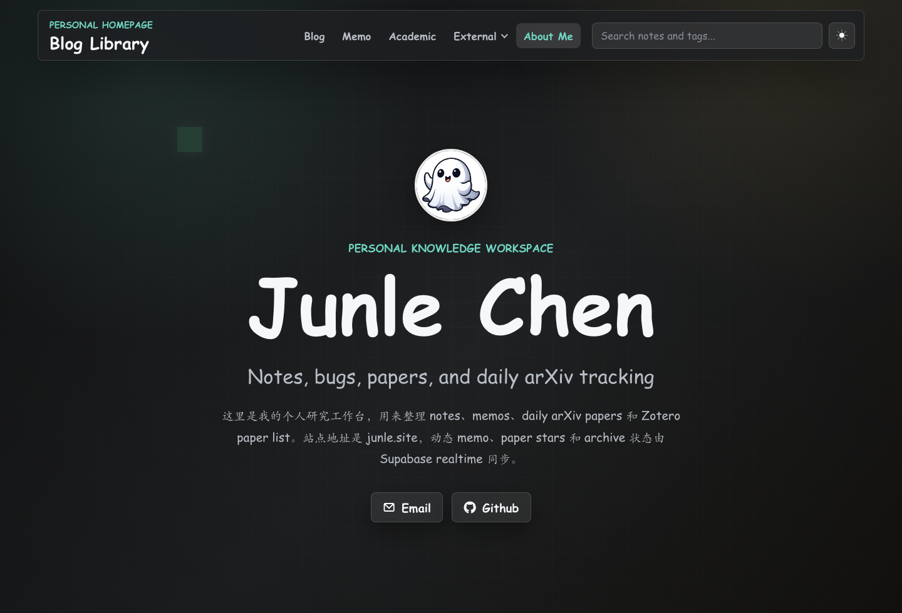
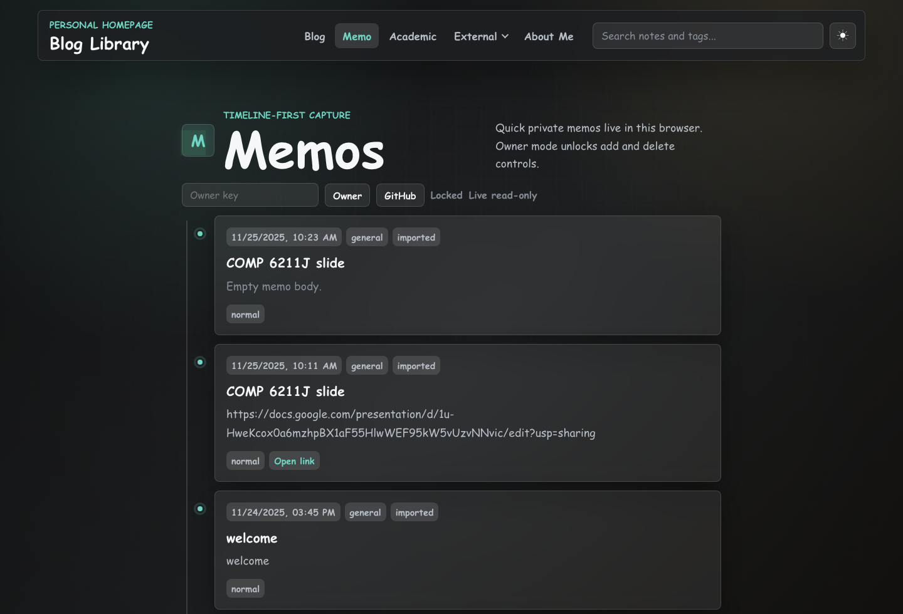
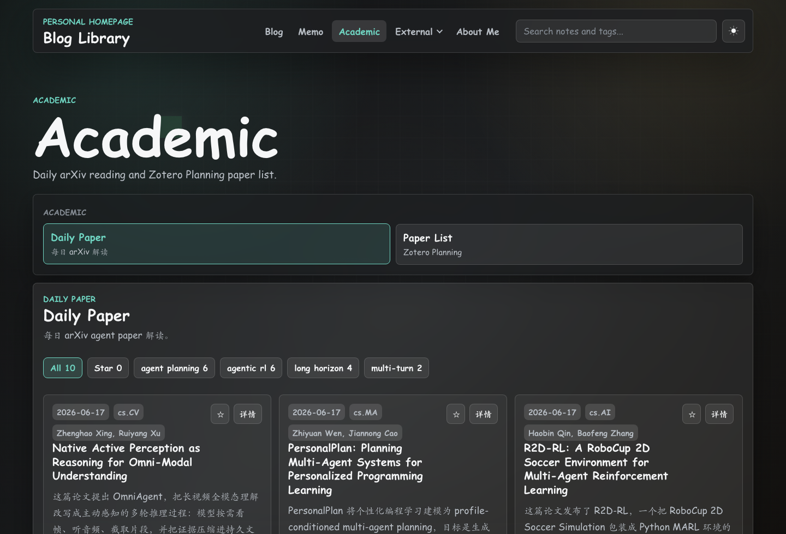
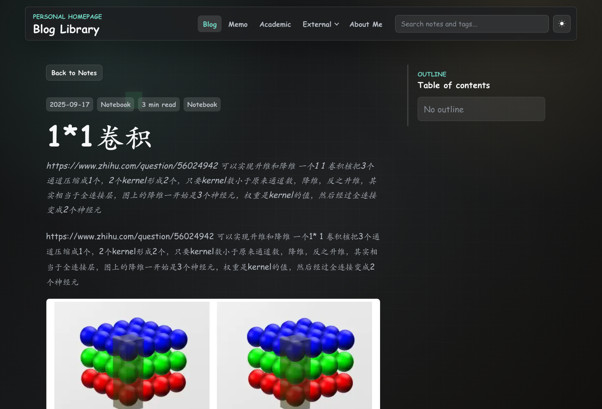
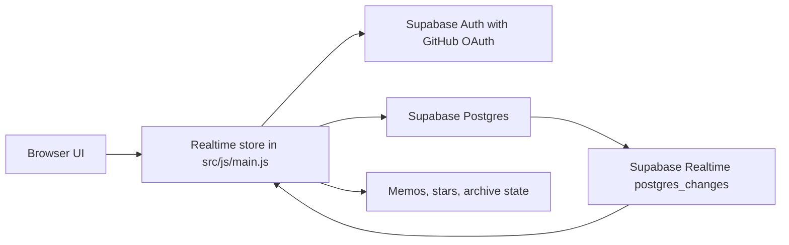

# Academic Homepage Template

If you like this template or wish to use it, please consider giving this repository a star.

- Live demo: [https://junle.site](https://junle.site)
- Repository: [junle-chen/ac-homepage](https://github.com/junle-chen/ac-homepage)

Academic Homepage Template is a static academic homepage and research workspace. It supports profile pages, notes, memos, paper-reading summaries, Daily Paper tracking, Zotero paper lists, Giscus comments, and Supabase-backed realtime state without requiring a custom backend server.

## Screenshots

### About / Profile



The About screen works as the entry point for a compact academic profile, research interests, selected publications, contact links, and quick access to the workspace sections.

### Memos



Memos provide a timeline-style writing area. Public visitors can read published memos, while the configured owner can sign in with GitHub to add or delete memos. Supabase realtime keeps open browser sessions synchronized.

### Academic



The Academic section contains two research-reading views:

- `Daily Paper`: curated arXiv paper tracking with stars, short summaries, long reading notes, and exportable text.
- `Paper List`: a longer-term paper list generated from a Zotero or local library export.

### Notes Reader



Notes open inside the site reader instead of jumping to raw Markdown files. The reader supports rendered Markdown, images, MathJax, a right-side outline, archive state, and Giscus comments.

## Features

- `About`: academic profile, research interests, links, selected publications, and workspace entry points.
- `Notes`: in-site Markdown reader with search, categories, archive state, outline, images, and MathJax.
- `Memos`: timeline-style notes with owner-only realtime writes.
- `Academic`: Daily Paper, paper list, stars, paper details, reading summaries, and text export.
- `Realtime`: shared memo, paper-star, Zotero-star, and note-archive state through Supabase.
- `Comments`: Giscus comments backed by GitHub Discussions.
- `Deployment`: static build for GitHub Pages and optional custom domain.

## Configure The Template

1. Edit `config.json` for the page title, description, intro text, avatar, profile links, and WebGL background setting.
2. Replace `src/assets/avatar.png` with your own avatar.
3. Edit `src/assets/content/pages/aboutme.md` for the About page content.
4. Add long-form notes under `src/assets/content/notes/`.
5. Update paper data in:
   - `src/assets/content/data/daily-papers.json`
   - `src/assets/content/data/zotero-paper-list.json`
6. Configure Supabase only if you want shared realtime memos, stars, and archive state.
7. Configure Giscus only if you want GitHub Discussions comments.

## Realtime Architecture

The site is statically hosted. Dynamic state is handled by Supabase Auth, Supabase Postgres, and Supabase Realtime:


```mermaid
flowchart LR
  Browser["Browser UI"] --> Store["Realtime store in src/js/main.js"]
  Store --> Auth["Supabase Auth with GitHub OAuth"]
  Store --> DB["Supabase Postgres"]
  DB --> RT["Supabase Realtime postgres_changes"]
  RT --> Store
  Store --> UI["Memos, stars, archive state"]
```

### Frontend Entry Points

- `src/components/scripts.pug`
  - loads `@supabase/supabase-js@2`
  - loads `js/realtime-config.js`
  - loads `js/main.js`

- `src/js/realtime-config.js`
  - `supabaseUrl`: Supabase project URL
  - `supabaseAnonKey`: public publishable anon key
  - `ownerGithubIds`: GitHub numeric ids allowed to write
  - `ownerGithubLogins`: GitHub logins allowed to write
  - `redirectTo`: OAuth return URL for the current page

- `src/js/main.js`
  - creates the realtime store
  - exposes login, logout, memo, and reaction operations through `window.JunleRealtime`
  - updates UI modules through events such as `memos` and `reactions:daily_paper`

### Supabase Tables

The full schema is in `supabase/homepage-realtime.sql`.

`site_memos` stores timeline memos:

- `id`: memo uuid
- `title`, `content`, `category`, `priority`, `source`
- `created_by`: Supabase auth user id
- `created_at`, `updated_at`
- `deleted_at`: reserved soft-delete field

`site_reactions` stores shared UI state:

- `item_type`: `daily_paper`, `zotero_paper`, or `note_archive`
- `item_key`: stable item key from the site data
- `active`: whether the state is enabled
- `unique (item_type, item_key)`: one state row per item

### Auth And RLS

Supabase uses GitHub OAuth for owner login. The SQL helper `public.is_homepage_owner()` checks GitHub identity values from the Supabase JWT. Configure your own owner ids and logins in both:

- `src/js/realtime-config.js`
- `supabase/homepage-realtime.sql`

The intended Row Level Security behavior is:

- visitors can read published memos and reactions
- only configured owners can insert, update, or delete memos
- only configured owners can insert, update, or delete reactions

The Supabase anon key can be public in frontend code because writes are controlled by Auth and RLS. Keep GitHub OAuth client secrets, deployment tokens, and other private credentials outside the repository.

### Realtime Subscriptions

The frontend subscribes to Supabase `postgres_changes` events:

- `site_memos`: reloads the memo timeline after insert, update, or delete events.
- `site_reactions` with `item_type = daily_paper`: syncs Daily Paper stars.
- `site_reactions` with `item_type = zotero_paper`: syncs Paper List stars.
- `site_reactions` with `item_type = note_archive`: syncs archived note state.

When one signed-in owner updates a memo or star, other open browser sessions receive a realtime event and reload the current state.

### Local Fallback

If Supabase is not configured, the network is unavailable, or the visitor is not signed in:

- the static site still loads normally
- public content remains readable
- write actions become read-only or fall back to local `localStorage` state
- the UI can show `Local mode`, `Live read-only`, `Signed in read-only`, or `Live owner`

## Configure Supabase

1. Create a Supabase project.
2. Copy the Project URL and publishable anon key.
3. Run `supabase/homepage-realtime.sql` in the Supabase SQL Editor.
4. Enable GitHub in Supabase Authentication Providers.
5. Create a GitHub OAuth App with this callback URL:

```text
https://<project-ref>.supabase.co/auth/v1/callback
```

6. Put the GitHub Client ID and Client Secret into the Supabase GitHub provider settings.
7. Update `src/js/realtime-config.js`:

```js
window.JUNLE_REALTIME_CONFIG = {
	supabaseUrl: "https://<project-ref>.supabase.co",
	supabaseAnonKey: "<publishable-anon-key>",
	ownerGithubIds: ["<github-numeric-id>"],
	ownerGithubLogins: ["<github-login>"],
	redirectTo: window.location.origin + window.location.pathname,
};
```

8. Update the allowed owner ids/logins in `supabase/homepage-realtime.sql` before running it.

## Configure Giscus

Giscus uses GitHub Discussions as the comment backend. The config lives in `GISCUS_CONFIG` inside `src/js/main.js`.

Required setup:

1. Enable GitHub Discussions for your repository.
2. Install and authorize the Giscus GitHub App for your repository.
3. Use [giscus.app](https://giscus.app/) to generate:
   - `data-repo`
   - `data-repo-id`
   - `data-category`
   - `data-category-id`
4. Paste those values into `GISCUS_CONFIG`.

Each note uses its own `data-comment-term`, so every note gets a separate discussion thread.

## Local Development

```bash
npm install
npm run build
npm run dev
```

If you use pnpm and see `Ignored build scripts`, approve the dependency build scripts as prompted:

```bash
pnpm install
pnpm approve-builds
pnpm run build
pnpm run dev
```

`npm run build` generates `dist/`. `npm run dev` starts the gulp watcher and previews from `dist`.

## Project Structure

- `config.json`: page title, description, intro button, profile links, avatar, and WebGL background switch.
- `src/components/`: Pug templates.
- `src/css/`: LESS styles.
- `src/js/main.js`: page interactions, note reader, Giscus, and realtime store.
- `src/js/realtime-config.js`: public Supabase config.
- `src/assets/content/notes/`: long-form Markdown notes.
- `src/assets/content/pages/`: in-site Markdown pages.
- `src/assets/content/data/daily-papers.json`: Daily Paper data.
- `src/assets/content/data/zotero-paper-list.json`: Paper List data.
- `supabase/homepage-realtime.sql`: Supabase tables, RLS policies, and realtime publication.
- `dist/`: generated static site.

## Deploy

```bash
npm run build
```

GitHub Pages settings:

- Source: Deploy from a branch
- Branch: `gh-pages`
- Folder: `/ (root)`
- Custom domain: optional
- Enforce HTTPS: enabled

## Websites And Services Used

| Website or project | Use |
| --- | --- |
| [GitHub Pages](https://pages.github.com/) | Static hosting and custom domain deployment. |
| [GitHub](https://github.com/) | Source hosting, Discussions, and OAuth App setup. |
| [Giscus](https://giscus.app/) | Comment widget powered by GitHub Discussions. |
| [Supabase](https://supabase.com/) | Realtime database, Auth, and owner-only writes. |
| [arXiv](https://arxiv.org/) | Paper metadata and paper links for Daily Paper and Paper List content. |
| [Zotero](https://www.zotero.org/) | Local paper-library export source. |
| [jsDelivr](https://www.jsdelivr.com/) | Runtime CDN for frontend libraries. |
| [anime.js](https://animejs.com/) | Animation timing and transitions. |
| [MathJax](https://www.mathjax.org/) | LaTeX rendering for notes and paper details. |
| [Supabase JS](https://supabase.com/docs/reference/javascript/introduction) | Browser client for Auth and Realtime. |
| [Alibaba Iconfont](https://www.iconfont.cn/) | Icon font for link buttons. |
| [SimonAKing/HomePage](https://github.com/SimonAKing/HomePage) | Original homepage structure and intro style. |
| [WebGL Fluid Simulation](https://github.com/PavelDoGreat/WebGL-Fluid-Simulation/) | WebGL fluid background implementation. |
| [Beautiful Jekyll](https://github.com/daattali/beautiful-jekyll) | Historical imported notes-site assets. |
| [bootstrap-social](https://github.com/lipis/bootstrap-social) | Historical imported social-button CSS asset. |

## License And Attribution

The reusable website source code keeps the upstream `LGPL-3.0-only` license from [SimonAKing/HomePage](https://github.com/SimonAKing/HomePage). Keep `LICENSE`, `NOTICE.md`, and `ATTRIBUTION.md` when redistributing the code.
